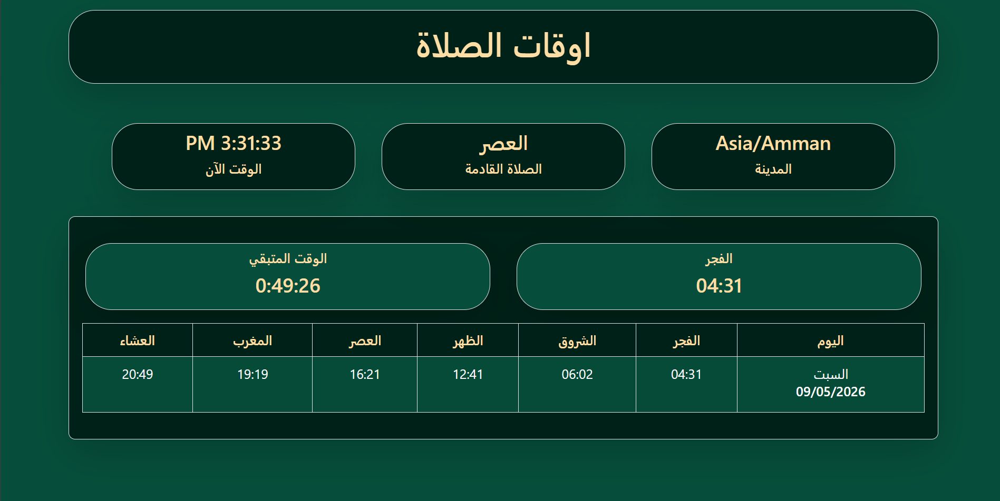

# Prayer Times App

A JavaScript application that displays daily prayer times based on the user's location using the AlAdhan API.

## Features

- Get user's location
- Display daily prayer times
- Arabic prayer names
- Display city information
- Responsive design

## Technologies

- JavaScript
- Axios
- Bootstrap
- AlAdhan API

## Screenshot

